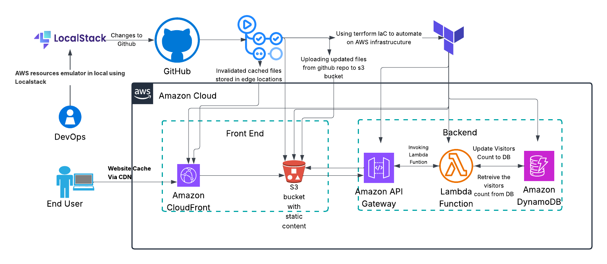

# Cloud CV - SRE/DevOps Engineer Portfolio

A modern, cloud-hosted resume showcasing SRE/DevOps expertise with AWS best practices.

## 🏗️ Architecture



This project demonstrates enterprise-grade DevOps practices:

- **Infrastructure as Code**: Terraform for reproducible infrastructure
- **CI/CD Pipeline**: GitHub Actions for automated deployment
- **Serverless**: AWS Lambda for visitor counter
- **CDN**: CloudFront for global content delivery
- **Security**: SSL/TLS, IAM roles, least privilege access
- **Monitoring**: CloudWatch for observability

## 🚀 Local Development

### Prerequisites
- Docker
- AWS CLI (for LocalStack)

### Start LocalStack
```bash
# Start LocalStack environment
./scripts/local-dev-start.sh start

# Upload files to local S3
./scripts/local-dev-start.sh upload

# Check status
./scripts/local-dev-start.sh status

# Stop when done
./scripts/local-dev-start.sh stop
```

### Access Local Development
- **Website**: http://localhost:4566/cloud-cv-local/index.html
- **S3 Browser**: http://localhost:4566/cloud-cv-local/
- **LocalStack Health**: http://localhost:4566/_localstack/health

## 🚀 Production Deployment

### Infrastructure as Code (Terraform)

The project uses Terraform to provision AWS resources:

<details>
<summary>📋 View Terraform Configuration</summary>

```hcl
# S3 Bucket for static website hosting
resource "aws_s3_bucket" "website" {
  bucket = "cloud-cv-${random_id.bucket_suffix.hex}"
}

# CloudFront distribution for CDN
resource "aws_cloudfront_distribution" "website" {
  origin {
    domain_name = aws_s3_bucket.website.bucket_regional_domain_name
    origin_access_control_id = aws_cloudfront_origin_access_control.website.id
  }
}

# Lambda function for visitor counter
resource "aws_lambda_function" "visitor_counter" {
  filename         = "../lambda/visitor_counter.zip"
  function_name    = "cloud-cv-visitor-counter"
  runtime         = "python3.11"
}

# DynamoDB table for visitor data
resource "aws_dynamodb_table" "visitor_counter" {
  name           = "visitor-counter"
  billing_mode   = "PAY_PER_REQUEST"
  hash_key       = "id"
}
```
</details>

### GitHub Actions CI/CD Pipeline

The project uses GitHub Actions for automated deployment via `.github/workflows/deploy.yml`:

<details>
<summary>🔄 View GitHub Actions Workflow</summary>

```yaml
name: Deploy Cloud CV
on:
  push:
    branches: [main]
  workflow_dispatch:

jobs:
  deploy:
    runs-on: ubuntu-latest
    steps:
      - name: Checkout code
        uses: actions/checkout@v4
      
      - name: Configure AWS credentials
        uses: aws-actions/configure-aws-credentials@v4
        with:
          aws-access-key-id: ${{ secrets.AWS_ACCESS_KEY_ID }}
          aws-secret-access-key: ${{ secrets.AWS_SECRET_ACCESS_KEY }}
          aws-region: us-east-1
      
      - name: Deploy Infrastructure
        run: |
          cd infra/terraform
          terraform init
          terraform plan
          terraform apply -auto-approve
      
      - name: Upload Frontend Files
        run: |
          aws s3 cp frontend/index.html s3://$(terraform output -raw bucket_name)/
          aws s3 cp frontend/styles.css s3://$(terraform output -raw bucket_name)/
          aws s3 cp frontend/script.js s3://$(terraform output -raw bucket_name)/
          aws s3 cp cv.pdf s3://$(terraform output -raw bucket_name)/
      
      - name: Invalidate CloudFront Cache
        run: |
          aws cloudfront create-invalidation --distribution-id $(terraform output -raw cloudfront_distribution_id) --paths "/*"
```
</details>

### Deployment Process
1. **Push to main branch** triggers GitHub Actions
2. **Terraform applies** infrastructure changes
3. **Frontend files** are uploaded to S3
4. **CloudFront cache** is invalidated
5. **Website** is live with latest changes

### Required GitHub Secrets
- `AWS_ACCESS_KEY_ID`
- `AWS_SECRET_ACCESS_KEY`

## 👨‍💻 Author

**SRE/DevOps Engineer** with 12+ years of experience
- Website: [l4linux.com](https://l4linux.com)
- LinkedIn: [https://www.linkedin.com/in/lekshmin](https://www.linkedin.com/in/lekshmin)
- GitHub: [https://github.com/Lforlinux](https://github.com/Lforlinux)

---

*This project demonstrates modern DevOps practices and cloud architecture expertise.*